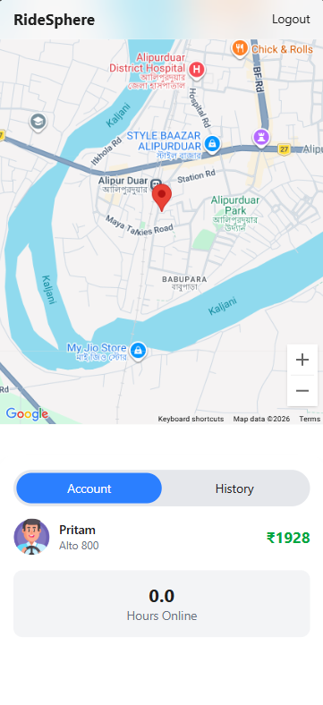
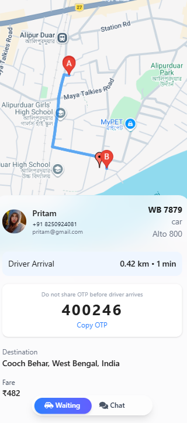
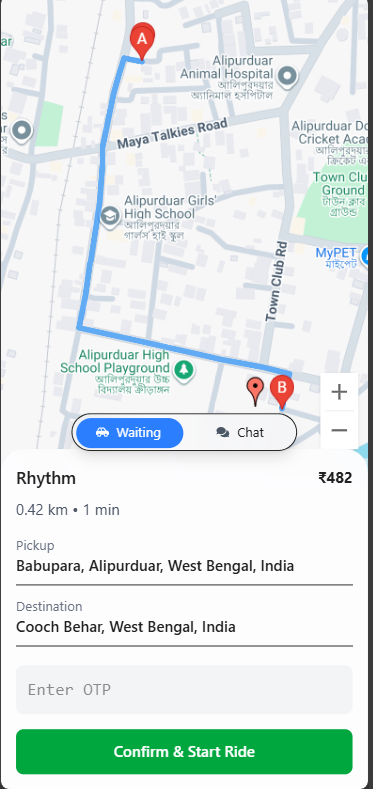
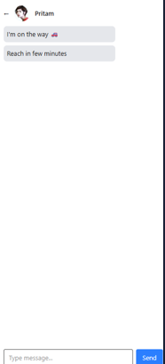

# RideSphere

A full-stack ride-hailing application inspired by platforms like Uber and Ola. RideSphere includes a polished mobile-first UI, real-time ride matching, live driver tracking, chat, and secure payment flows.

## 🚀 Project Description

RideSphere is a real-time ride-hailing application built to deliver a seamless booking and tracking experience. Built with React.js on the frontend and Node.js + Express on the backend. It supports both riders and captains (drivers), real-time ride requests using Socket.IO, Google Maps-based routing, distance and ETA calculations, and Razorpay payment integration.

## ✨ Features

- User and Captain authentication with JWT
- Responsive mobile-first UI with a modern glassmorphism design
- Real-time ride request system using Socket.IO
- Driver matching based on proximity (within 2km radius)
- Ride lifecycle flow:
  1. User selects pickup and destination
  2. Captain receives ride request
  3. Captain accepts the ride
  4. OTP verification before starting
  5. Live tracking from driver to pickup and pickup to destination
  6. Ride completion
  7. Payment via Razorpay or cash
- Google Maps integration for directions, distance matrix, and geolocation
- Live location tracking via browser Geolocation API
- In-app chat between user and captain
- Ride history and activity log
- Quick rebook past rides
- Clean REST APIs + WebSocket architecture

## 🧰 Tech Stack

- Frontend: React.js, Tailwind CSS, GSAP animations
- Backend: Node.js, Express.js
- Database: MongoDB
- Realtime: Socket.IO
- Maps: Google Maps API (Directions, Distance Matrix, Geolocation)
- Payments: Razorpay

## 📁 Folder Structure

```
RideSphere/
├── Backend/
│   ├── app.js
│   ├── socket.js
│   ├── package.json
│   ├── .env
│   ├── Controllers/
│   ├── Middlewares/
│   ├── Models/
│   ├── Routes/
│   └── services/
└── frontend/
    ├── package.json
    ├── vite.config.js
    ├── .env
    ├── src/
    │   ├── App.jsx
    │   ├── main.jsx
    │   ├── index.css
    │   ├── components/
    │   ├── context/
    │   └── pages/
    └── public/
```

## ⚙️ Installation & Setup

````
1. Install backend dependencies:
```bash
cd Backend
npm install
````

2. Install frontend dependencies:
   ```bash
   cd ../frontend
   npm install
   ```

## 🔐 Environment Variables

Create `.env` files in both `Backend/` and `frontend/` as needed.

### Backend `.env`

```env
PORT=5000
MONGODB_URI=<your_mongodb_connection_string>
JWT_SECRET=<your_jwt_secret>
RZP_KEY_ID=<your_razorpay_key_id>
RZP_KEY_SECRET=<your_razorpay_key_secret>
GOOGLE_MAPS_API_KEY=<your_google_maps_api_key>
CLIENT_URL=http://localhost:5173
```

### Frontend `.env`

```env
VITE_API_URL=http://localhost:5000
VITE_GOOGLE_MAPS_API_KEY=<your_google_maps_api_key>
```

> Note: Replace placeholder values with your actual credentials. Keep secrets out of source control.

## ▶️ Run Locally

### Start the backend

```bash
cd Backend
npm start
```

### Start the frontend

```bash
cd frontend
npm run dev
```

Open the frontend at the URL shown by Vite (typically `http://localhost:5173`). Ensure the backend is running first so the app can connect to API and socket services.

## 🖼️ Screenshots

> Add screenshots here after capturing the UI.

- 
- 
  
  
  


## 🚧 Future Improvements

- Add automated tests for backend and frontend flows
- Implement driver rating and review system
- Add support for multiple ride types and fare estimation
- Add push notifications for ride status updates
- Build admin dashboard for ride analytics and user management
- Improve accessibility and advanced localization support

## 🧑‍💻 Author

**RideSphere**

- GitHub: [github.com/Rhythm82](https://github.com/Rhythm82)
- Email: `<rhythmdas82@gmail.com>`

---

Built with modern web technologies for a seamless ride booking experience.
